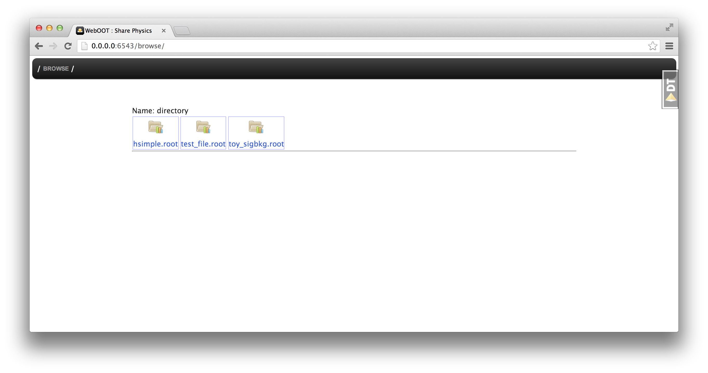
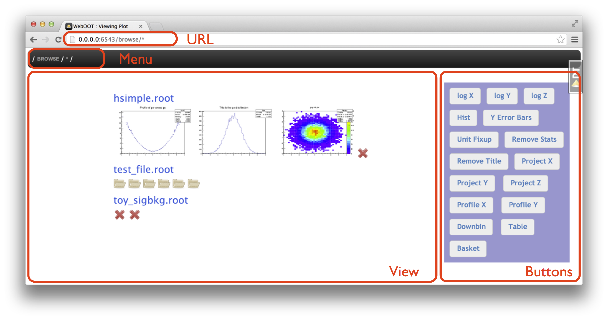

Tutorial
========

This is a 10 minute tutorial introduction to WebOOT.

If you find that someting is not working or have questions and feature requests,
please send an email to the WebOOT mailing list or file an issue on github. 

Starting WebOOT
---------------

We have put a few example ROOT files in the ``WebOOT/docs/data`` folder
for you to play with. Open a terminal and type these commands::

	cd WebOOT/docs/data
	weboot

This should open WebOOT in your web browser:

From now on the terminal will only be used for logging messages, you only
need to go back to it if there is an error or if you want to quit WebOOT,
which you simply do by typing ``CTRL + C`` or closing the terminal window.

User interface
--------------

The main idea of WebOOT is that you can browse your data and make plot
by going to some URL. At the start you are at ``http://0.0.0.0:6543/browse/``
(your IP or port number may be different) and WebOOT shows you all the
files in the current working directory where you started WebOOT.

Now you can start browsing your data and making plots, e.g. simply add a ``*``
at the end of the URL (i.e. go to ``http://0.0.0.0:6543/browse/*`` and you will
see the top-level contents of the ROOT files:

The main **View** area shows your results and you can use the **URL**, **Menu** or
**Buttons** to control what is shown, or directly click on an object in the **View** area.

The rest of this tutorial is a series of instructions for things for you to try out,
we will not give screenshots any more. When we show URLs we will only show the part
that follows ``http://0.0.0.0:6543/browse/``. 

Let's try out a few things:

#. Go to the URL ``*``
#. Click on the rightmost image in ``hsimple.root`` (called ``py vs px``),
   which will take you to the URL ``hsimple.root/hpxpy/``
#. Hit the back button in your web browser to get back to the URL ``*``
#. Go to the URL ``hsimple.root/hpx/`` by typing it in the address bar in your browser
#. Hit the ``log Y`` toggle button a few times
#. Click on ``Browse`` in the menu to go back to the list of ROOT files

.. note:: There are two types of buttons.
   Some append something to the URL (e.g. *Profile X* appends ``/!profile/x``),
   others are toggle buttons that don't change the URL, i.e. can't be shared in a link or bookmarked (e.g. *log Y*).

Actions
-------

WebOOT is a web application that lets you browse your file system to find ROOT files as well as
browse ROOT file contents to find histograms, trees or all kinds of other ROOT objects.

It does this by executing ROOT in the background (via PyROOT and rootpy) and executing so called **actions** on
Python-wrapped ROOT objects. As a user you don't have to understand how it works in detail, but it is
useful to know that you can append ``/!list_actions`` to any URL and get a complete list of actions
that can be executed on the current object in the view.

Give it a try:

#. Go to ``hsimple.root/hpxpy/`` to view a 2-dimensional histogram,
   then to ``hsimple.root/hpxpy/!list_actions`` to view the available actions.
#. Go to ``hsimple.root/hpxpy/!profile/x/`` to create and view a 1D profile of the 2D histogram.

All actions start with an exclamation mark ``!`` followed by the name of the action, followed
by the arguments for the action separated by slashes ``/``. E.g. ``!list_actions`` above was
and example of an action with zero arguments, and ``!profile/x/`` was an example with one argument.

If you do things that are not possible, you'll get an error message.
I you want you can try out ``hsimple.root/hpxpy/!fly_to_moon`` and ``hsimple.root/hpxpy/!profile/``
to see what that looks like.
 
Star and compose
----------------

As you've seen already, you can use a star ``*`` as a wildcard in the URL.

Here's some examples you should try:

#. ``*`` shows the available ROOT files
#. ``*/*`` shows more of the content in those files
#. ``test_file.root/efficiencies/hist*/`` shows all objects in the file ``test_file.root``
   in the directory ``efficiencies`` where name starts with ``hist``.
#. ``test_file.root/means/*``
#. The ``*`` doesn't have to be at the end of the URL, e.g. ``toy_sigbkg.root/Tree*/!draw/var1/``
   will create histograms for the ``var1`` branch from the ``TreeS`` and ``TreeB`` trees
   in the ``toy_sigbkg.root`` file.

When you have plotted a group of similar objects you can ``!compose`` them into one plot:

#. ``test_file.root/efficiencies/hist*/!compose/stack`` will plot the four histograms
   selected by ``test_file.root/efficiencies/hist*`` into one plot.
#. ``toy_sigbkg.root/Tree*/!draw/var1/!compose/stack`` is another example.

The ``*`` is a powerful tool to select multiple objects, it even works across ROOT files,
i.e. if you have two files ``file_a`` and ``file_b`` with histograms in directories called ``hists``,
then ``file_*/hists/*`` will show you all of them at once. Here it pays off if you have organized
your data in your ROOT files in a simple and repetitive pattern. 

Plots
-----

As you've seen already, one of the main features of WebOOT is to quickly and easily make plots. 
Let's see some more examples and available actions.

1D histogram:

#. ``hsimple.root/hpx/``
#. ``hsimple.root/hpx/!rebin/5``
#. ``hsimple.root/hpx/!range/x/-2/1``
#. ``hsimple.root/hpx/!binrange/x/40/70``
#. ``hsimple.root/hpx/!normalize/1``

2D histogram:

#. ``hsimple.root/hpxpy``
#. ``hsimple.root/hpxpy/!normaxis/x``
#. ``hsimple.root/hpxpy/!project/x``
#. ``hsimple.root/hpxpy/!profile/x``
#. ``hsimple.root/hpxpy/!explode/x/!project/y``

The buttons on the right side are pretty much self-explanatory, just try them out.

Trees
-----

Plot histograms:

#. ``hsimple.root/ntuple/!draw/px``
#. ``hsimple.root/ntuple/!draw/p*``
#. ``hsimple.root/ntuple/!draw/p*/!compose/stack``
#. ``hsimple.root/ntuple/!scan/px:py``

Print entries:

#. ``hsimple.root/ntuple/!scan/px``
#. ``hsimple.root/ntuple/!scan/px:py``
#. ``hsimple.root/ntuple/!scan/*``

TODO: How to apply a cut to select a subset of the entries?

Export
------

Download ROOT file:

#. ``hsimple.root/!download``

Generate high-quality versions of your plots:

#. ``hsimple.root/hpx/!render/png``
#. ``hsimple.root/hpx/!render/png?resolution=150`` -- zoom to 150%
#. ``hsimple.root/hpx/!render/pdf``

Probably your browser will by default display PNGs in the browser.
PDFs might be displayed in your browser or saved in your download folder and possibly opened in some other PDF viewer.

